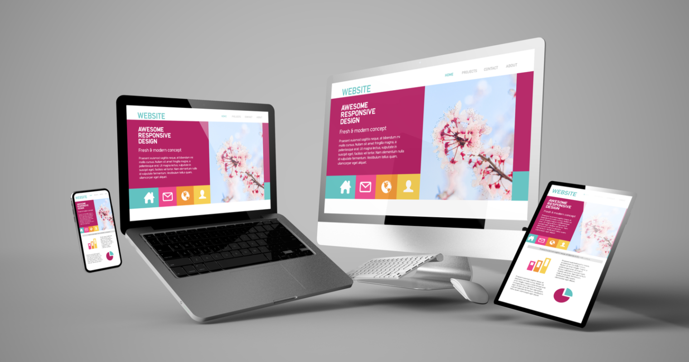

## Underneath the Skin

What does a half-done house look like? I've seen a few of them in the middle of construction, but I've always been intrigued by how they're put together. It is incredibly interesting to see beneath the skin of a building and be amazed at the intricate weaving of electrical wires, plumbing, light fixtures and insulation. And all these things are inserted around a frame that forms the skeleton of a house. Without this frame beneath the surface, the beautiful exterior would never be possible. Likewise, when you want to put together the pieces of a website, you need a structure to build off of. And that is where frameworks come in.

## The Skeleton of Web Design

Skeletons are the primary structural component of a body; they provide the framework to add all of the more aesthetic exterior materials. When you use a framework, it is so much easier to add all of those fascinating touches to your website's appearance. Not only that, but frameworks allow you to organize your elements in a more efficient way. Being able to select each different area to modify it as needed is one of the most enjoyable things about working with a framework. You don't need to specify attributes for each and every element; just give the elements an identifier that assigns those attributes to those things that contain it.

## Breaking the Language Barrier

Probably my most favorite thing to do with coding is to create actual, tangible products. It is incredibly satisfying to spend quality time coding in order to manufacture an appealing, functioning website. Yet it constantly frustrates me when I try to manipulate my page and I don't know what I'm supposed to say. Enter framworks. When I first began using Semantic UI, I was stunned by the simplicity of the verbiage. Need to make a menu? Just type "menu" and add whatever modifiers you would like. Is that icon the wrong size? Simply specify it as a "large" or "tiny" icon...presto! The framework knows exactly what you want and does it. Yes, you cannot just type anything...a framework is not a thesaurus. But the barrier between human and machine communication is much easier to overcome when you have a framework like Semantic UI.

## Frame That Thing

We do it to all the things we want to display prominently: diplomas, family pictures, certificates. Those things are important to us, so we put them in a frame and hang it on the wall for all to see. What are you going to do with your website? Well I hope you're planning to put it out there for the world to use and enjoy. So naturally...you should frame it! Frameworks provide that context, control and structure that you need to present appealing material. Just in the past week, I have learned the power that you can wield over your website when you use a framework to your advantage. You don't need to type out long confusing CSS and HTML to get a mediocre-looking page. Leverage every resource you have, and make that website pop out at everyone who visits...just like the pictures that you frame on your wall.

