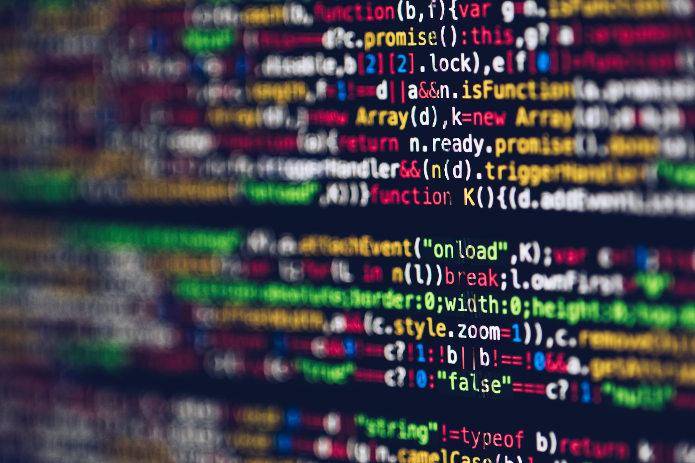

## Squiggles, Lightbulbs and Red X's...Oh My

You know the feeling: you spend all day working on a bit of code, figuring out syntax and trying to get it to work, and then you're finally rewarded with the proper output in the console. But wait! Before you can call it good and submit your project, you have to fix all those little error warnings all over your development environment. But why? The code works, and changing it is just going to require a lot more work. For what? Your code gets all messed up, you can't find anything anymore, and all sorts of things change. So why should anyone want to obey all those nagging little error messages? While it may be annoying, there is a very good reason for it.

## Clean Code is the Best Code

Why should you use tools to enforce coding standards? Isn't it easier to just create your code in an IDE, make sure the syntax works, and then run it? Why waste time on needless "grammar" rules when the program still runs anyway? The biggest reason: coding standards make you write better code. By using coding standards, you learn to make your program work without needless bloating. You can get rid of variables you don't need, shorten the code required for functions, and use the most efficient operators. Tools that enforce coding standards are like a close friend who's not scared to tell you you're wrong. Yes, they're unforgiving, but they force you to perform to a higher level of coding excellence, and that is by all means a good thing. By accepting the fact that the IDE and its tools are better than even the sharpest eye at spotting typos and small errors, you will be able to use the tools to your advantage and form an ideal work flow. Not only do coding standards help you write clean, efficient code, it can help you do the coding work in the first place.

## The Standards Have Your Back

I have utilized multiple IDEs and code quality checkers over the past couple of years as a computer science student, and quite often, coding standards have simply been another hurdle that made assignments more difficult and time-consuming. Yet recently, studying software engineering, I have realized how key the coding standards are to programming. Over the past weeks, I have been learning a new IDE, IntelliJ Idea, along with standards for a new language, JavaScript. Believe it or not, the coding standards that are expected for my class have been helping me solve the coding problems that I face. I cannot tell you how many times I have written code without an IDE or quality checker and spent lengthy amounts of time debugging it only to realize I misspelled a single parameter. Yet, with a properly configured coding standards checker, that would never be an issue. If I created a function "checkNums" and then called it later, spelling it "checkNum", my tools would immediately tell me that "checkNum is not declared" or something along those lines. Thus, with the proper application of tools, I could potentially save *hours* of debugging time. From my perspective, this is game-changing.

## Saving Time, Coding Better, Helping Others

When you spend the time to properly set up a development environment with the tools that will help you, it is undeniable that you will work better as a programmer. Not only will you write cleaner code and run into fewer problems, your attempts at collaboration will meet with much more success. When you apply a common standard to your work, it will be all that more familiar to your fellow software engineers. Ultimately, coding standards help (some might even say force) you to be a much, much better programmer. If you're willing to put in the work and careful preparation required to set up your tools, and apply the standards required to write good code, you will reap the rewards for years to come. Oh, also: finally getting that little green checkmark feels pretty good, too.
