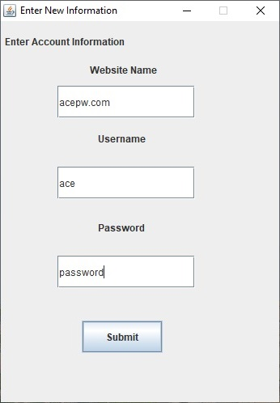
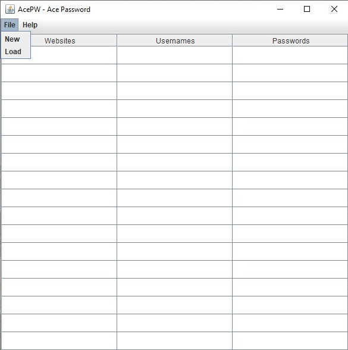

  
  

Ace Password Manager (Ace PW) is a simplistic yet secure password manager that leverages the abilites of Java, as well as the principles Microsoft's Secure Development Life-Cycle to create an application for users to store usernames and passwords in a local client as well as a secure .txt file. It was developed by myself and the other members of my team in ICS 427, Software Quality Assurance/Secure Development. Using security strategies, project lifecycle managment, and robust testing, we created a password manager that protects PII amd sensitive login data from attackers attempting to access a local device.

You can learn more at the [Ace PW Website](https://github.com/christiancheshire/AcePassWord-AcePW).
