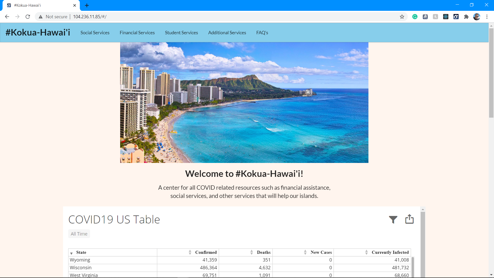
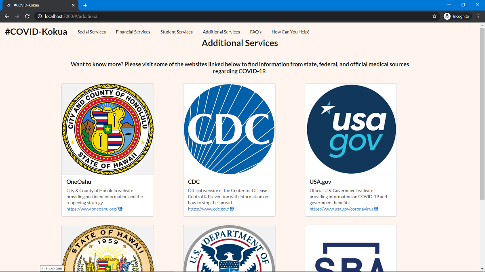

  
  

Kokua Hawai'i (aka "COVID Kokua) is a simplistic web application that my team and I designed as our final project for ICS 314, Software Engineering at UH Manoa. The basic concept is to serve as a common hub for a wide array of COVID-19 resources. These include financial aid, student services, and social resources, all with the goal of helping as many people through the tough times of coronavirus. 

Throughout the design process, our team of four utilized IntelliJ Idea as an integrated development environment (IDE), and GitHub as a team development and cloud storage service. Due to the remote nature of working together in these unique times, Discord served as an effective text and voice platform to communicate, collaborate, and share creative ideas. Kokua Hawai'i utilized a potent tech stack, primarily using JavaScript code, along with Semantic UI, React, and Meteor.

Kokua Hawai'i utilized the basic knowledge and skills we developed throughout our semester of learning software engineering. It has the potential to expand and have greater functionality. Hopefully, it will not be a permanent resource (since we hope COVID goes away!) but it has provided an effective skeletal framework for future projects to build off of.

You can learn more about the website and its development process, and find links to try it for yourself at [KOKUA HAWAI'I](https://covid-kokua.github.io/).
