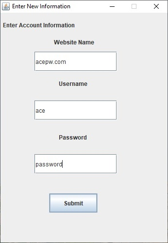
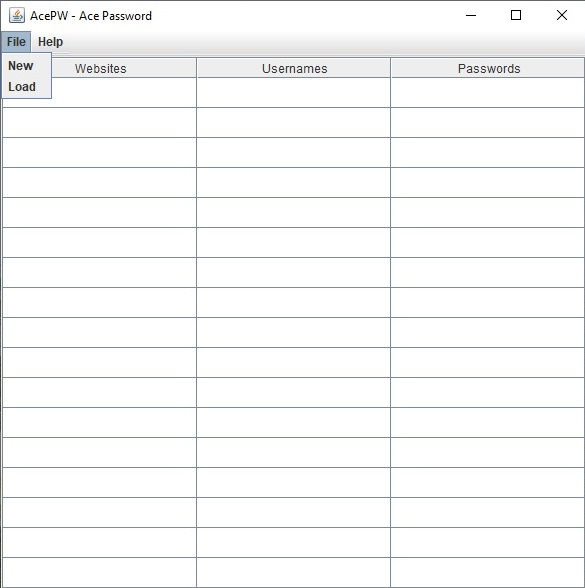

  
  

Ace Password Manager (Ace PW) is a simplistic yet secure password manager that leverages the abilites of Java, as well as the principles Microsoft's Secure Development Life-Cycle to create an application for users to store usernames and passwords in a local client as well as a secure .txt file.

You can learn more at the [Ace PW Website](https://github.com/christiancheshire/AcePassWord-AcePW).

