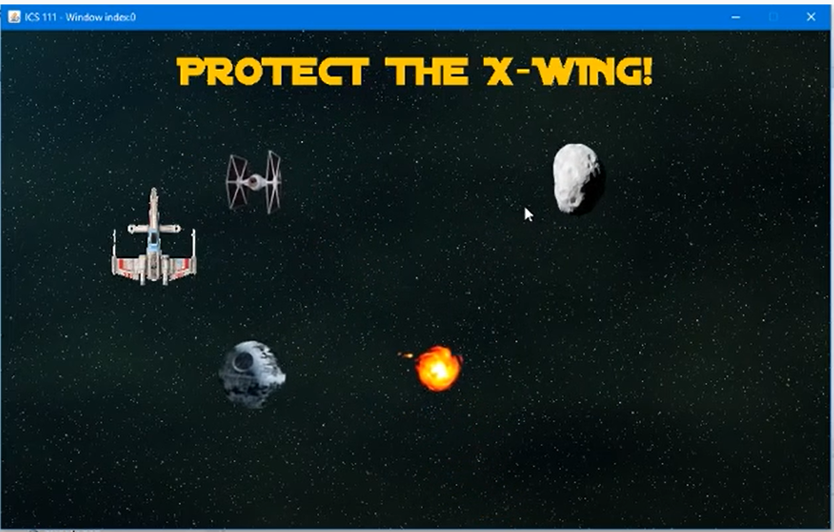
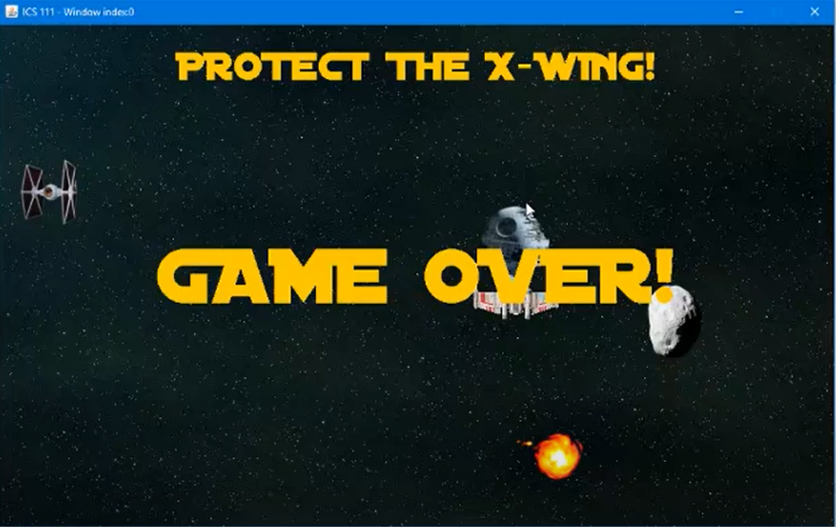

  
  

Star Wars Dodgeball is a computer-based, space themed game designed as one of my projects for ICS 111. It places players at the controls of an X-Wing fighter, and presents them with a challenge: dodge the incoming missiles of the Empire! Fireballs, lasers, tie-fighters, asteroids and even a death star will attack the X-Wing, and the player must do their best to avoid them. If the X-Wing is impacted three times, the game will end with an ominous message from Darth Vader himself. Players must be extra careful, as the speed of the missiles will increase the longer they manage to stay alive!

Watch the full gameplay at: https://www.youtube.com/watch?v=PifG8UwMESg
